# KYCC Pipeline Architecture: Iterative Learning

This document describes the **Iterative Learning** pipeline where models are trained on past batches and score future batches.

## Core Principle: The Batch Lag Rule
> [!IMPORTANT]
> **TEMPORAL SAFETY**: A batch must NEVER be scored with a model trained on its own labels.
> *   **Batch N** is scored with Model `v_N` (trained on Batch N-1).
> *   **Batch N** labels are used to train Model `v_N+1`.
> *   **Batch N+1** is scored with Model `v_N+1`.

## Workflow Diagram

```mermaid
graph LR
    subgraph "Day 1: Score Batch N"
        S1[Ingest BATCH_N profiles]
        S2[Extract Features]
        S3[Score with v_N]
    end
    
    subgraph "Day 2: Labels Arrive"
        L1[Ingest BATCH_N labels]
    end
    
    subgraph "Day 3: Train New Model"
        T1[Build Training Matrix]
        T2[Train Model]
        T3[Register v_N+1]
        T4[Evaluate & Activate]
    end
    
    subgraph "Day 4: Score Batch N+1"
        S4[Ingest BATCH_N+1 profiles]
        S5[Extract Features]
        S6[Score with v_N+1]
    end
    
    S1 --> S2 --> S3
    S3 -.-> L1
    L1 --> T1 --> T2 --> T3 --> T4
    T4 -.-> S4
    S4 --> S5 --> S6
    
    style S3 fill:#90EE90
    style T3 fill:#FFB6C1
    style S6 fill:#90EE90
```



## Jobs

The pipeline is split into two distinct Dagster jobs to enforce this separation.

### 1. `score_batch_job` (Online)
Scores a new incoming batch.
*   **Input**: `{BATCH_ID}_profiles.json` (Features only)
*   **Logic**: 
    1.  Ingest Profiles.
    2.  Check for temporal leakage (Active model != Trained on this batch).
    3.  Compute Features.
    4.  Fetch Active Model (`v_active`) from Registry.
    5.  Compute Scores & Persist.
*   **Output**: Records in `score_requests` and `credit_scores` tables.

### 2. `train_model_job` (Offline)
Trains a new model on a completed batch.
*   **Input**: `{BATCH_ID}_labels.json` (Labels only)
*   **Logic**:
    1.  Ingest Labels.
    2.  Validate batch was previously scored.
    3.  Build Matrix (Join Features + Labels).
    4.  Train Logistic Regression.
    5.  Register new version (`v_new`).
    6.  Auto-activate if performance improves.

## Execution

### CLI Automation
Use the cycle script to orchestrate the flow:

```bash
# Run full cycle for Batch 1 (Score -> Train)
./scripts/run_full_cycle.sh 1
```

### Manual Steps
1.  **Generate Data**: `python scripts/generate_synthetic_batch.py --batch-number 1`
2.  **Score**: Run `score_batch_job` config `{"batch_id": "BATCH_001"}`
3.  **Train**: Run `train_model_job` config `{"batch_id": "BATCH_001"}`
